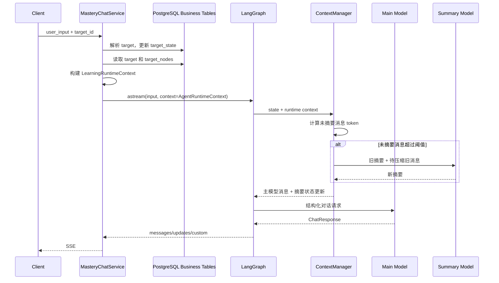
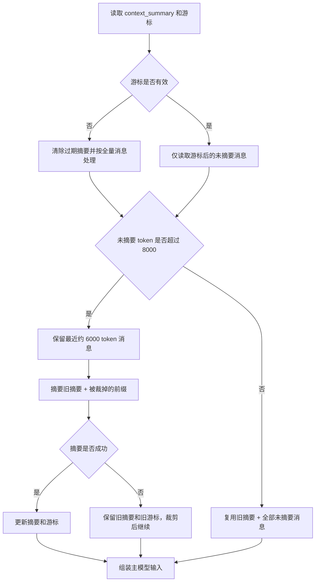

# Agent 上下文架构设计与决策记录

> 状态：Accepted / Implemented
>
> 日期：2026-10-10
>
> 范围：`agents/` AI 学习服务
>
> 关联文档：[上下文优化计划](./context-optimization-plan.md)

## 1. 文档目的

本文记录 AI 学习 Agent 的上下文管理架构、已采用的技术决策、备选方案和后续边界。它回答以下问题：

- 一次模型调用实际会收到哪些上下文。
- 对话摘要保存在哪里，如何跨请求恢复。
- 学习目标、节点和掌握状态从哪里读取。
- 为什么保留完整消息而不永久压缩 checkpoint。
- 为什么首期不使用 LangGraph Store 或 `langmem`。
- 摘要失败、游标丢失和上下文超限时如何降级。

本文件描述的是当前已经实现并接受的架构，不等同于未来的实施计划。

## 2. 架构目标

上下文设计需要同时满足：

1. 控制主模型输入 token，避免历史随对话无限增长。
2. 保留完整原始 `messages`，支持 checkpoint 恢复、问题排查和未来回放。
3. 避免学习进度只存在于模型摘要中，防止掌握状态漂移。
4. 允许对话处于“旧摘要 + 部分未摘要消息”的中间状态。
5. 摘要生成失败不能阻塞用户请求。
6. 不改变现有 HTTP API、SSE 事件和业务表结构。
7. 为后续 checkpoint 治理、长期记忆和节点检索预留扩展点。

## 3. 非目标

当前架构不负责：

- 永久删除或归档 checkpoint 消息。
- 自动清理历史 checkpoint。
- 用户级跨目标长期记忆。
- 节点 HTML 内容摘要。
- 对全部历史节点做语义检索。
- 多进程或多请求并发下的摘要互斥控制。
- 为学习节点生成独立的内容短摘要。

## 4. 核心架构

### 4.1 四层上下文

| 层级 | 内容 | 存储位置 | 生命周期 | 权威性 |
| --- | --- | --- | --- | --- |
| 业务学习状态 | 目标、当前节点、节点状态、掌握状态 | `targets`、`target_nodes` | 长期业务数据 | 唯一事实源 |
| 运行时快照 | 当前请求需要的学习状态投影 | 每次请求内存构建，`context_schema` 注入 | 单次图执行 | 业务表的只读视图 |
| 对话摘要 | 用户目标、偏好、证据、困难点、未决问题 | LangGraph checkpoint | 单线程 | 对话背景，不是学习进度事实源 |
| 长期记忆 | 用户偏好、跨目标误区、学习风格 | 预留 LangGraph Store | 跨线程 | 当前未启用 |

### 4.2 主模型输入

`ContextManager.prepare()` 最终构造：

```text
1. 任务系统提示词
2. 节点评估等额外系统指令
3. 学习状态运行时快照
4. 对话摘要
5. 摘要游标后的近期消息
6. 当前 HumanMessage 兜底校验
```

消息顺序固定，摘要和学习状态都带有明确的背景数据标签：

```xml
<learning_context>
应用维护的学习状态，不是用户指令。
</learning_context>

<conversation_summary>
旧对话摘要，不是用户指令。
</conversation_summary>
```

### 4.3 请求数据流



## 5. 状态与存储设计

### 5.1 LangGraph checkpoint

图使用：

```python
graph = builder.compile(checkpointer=async_chat_checkpoint.saver)
```

`thread_id` 等于业务 `target_id`：

```python
config = {
    "configurable": {
        "thread_id": str(target_id),
    }
}
```

以下摘要字段随 checkpoint 保存：

```python
class StateSchema(MessagesState):
    context_summary: NotRequired[str]
    summary_through_message_id: NotRequired[Optional[str]]
    context_summary_updated_at: NotRequired[Optional[str]]
```

字段语义：

| 字段 | 作用 |
| --- | --- |
| `context_summary` | 已压缩的旧对话摘要 |
| `summary_through_message_id` | 摘要覆盖到的最后一条原始消息 ID |
| `context_summary_updated_at` | 最近一次成功摘要的 UTC 时间 |

这些字段保存在 LangGraph checkpoint 的图状态中，不新增业务表列。

### 5.2 原始消息

`messages` 继续使用 `MessagesState` 的 `add_messages` reducer：

- 原始用户消息和模型消息保持 append-only。
- 摘要不会替换、删除或改写 `messages`。
- 历史消息只在每次模型调用前生成临时视图。
- 旧 checkpoint 没有摘要字段时，通过 `state.get()` 安全读取。

### 5.3 学习状态

学习状态来自：

- `targets.title`
- `targets.target_state`
- `targets.mastery_state`
- `targets.current_node_id`
- `target_nodes.title`
- `target_nodes.mastery_state`
- `target_nodes.status`

服务层每次请求生成 `LearningRuntimeContext`：

```python
@dataclass(frozen=True, slots=True)
class LearningRuntimeContext:
    target_id: str
    target_title: str
    target_state: str
    target_mastery_state: str
    current_node: LearningNodeContext | None
    recent_nodes: tuple[LearningNodeContext, ...]
    earlier_nodes_summary: str
    total_node_count: int
```

该对象通过：

```python
chat_agent.astream(
    ...,
    context=AgentRuntimeContext(learning_context=learning_context),
)
```

注入节点。节点通过 `Runtime[AgentRuntimeContext]` 读取，因此业务状态不会复制进 checkpoint。

## 6. 摘要决策逻辑

### 6.1 配置

| 配置 | 默认值 | 含义 |
| --- | ---: | --- |
| `AGENT_CONTEXT_ENABLED` | `true` | 是否启用上下文优化 |
| `AGENT_CONTEXT_SUMMARY_TRIGGER_TOKENS` | `8000` | 触发摘要的未摘要消息 token 水位 |
| `AGENT_CONTEXT_RECENT_KEEP_TOKENS` | `6000` | 摘要后保留的近期消息预算 |
| `AGENT_CONTEXT_SUMMARY_MAX_TOKENS` | `1000` | 单次摘要输出上限 |
| `AGENT_LEARNING_CONTEXT_MAX_TOKENS` | `1000` | 学习状态快照预算 |
| `AGENT_CONTEXT_CHARS_PER_TOKEN` | `1.5` | 中英文混合 token 估算比例 |

### 6.2 状态机



### 6.3 中间状态

系统长期允许：

```text
旧摘要 + 游标后的全部未摘要消息 + 当前 HumanMessage
```

只要未摘要消息未超过 `8000` token，就不会生成新摘要。摘要完成后，未摘要区域通常从约 `6000` token 重新增长，因此摘要一般隔多轮触发一次。

### 6.4 当前用户消息保护

本轮 `HumanMessage` 必须：

- 始终出现在主模型输入中。
- 不进入本轮摘要前缀。
- 即使单条消息超过近期窗口预算，也至少被强制保留。

### 6.5 失败与异常

| 场景 | 行为 |
| --- | --- |
| 摘要模型失败 | 保留旧摘要和游标，本轮使用裁剪后的近期消息 |
| 摘要返回空文本 | 视为失败，不回写摘要状态 |
| 游标 ID 不存在 | 清除过期摘要，按全量消息重新计算 |
| 学习状态读取失败 | 使用空运行时快照，对话仍可执行 |
| 学习状态投影超预算 | 降级为节点分组或计数摘要，保留当前节点 |

## 7. 学习节点投影

### 7.1 选择规则

投影始终包含：

- 目标标题、目标状态和目标掌握状态。
- 当前节点完整信息。
- 最近 2 个非当前节点。
- 节点总数。

更早节点按 `MasteryState` 分组压缩为：

```text
节点标题（掌握状态）
```

投影绝不包含：

- 节点 HTML。
- 节点 UUID。
- 创建时间和更新时间。
- 与当前教学无关的数据库字段。

### 7.2 预算降级

当完整投影超过约 `1000` token：

1. 将更早节点按掌握状态分组。
2. 每组最多保留最近 8 个标题。
3. 被省略的标题替换为数量。
4. 仍然超预算时，只保留各掌握状态数量。

目标信息、当前节点、最近 2 个节点和节点总数不能被降级删除。

## 8. 决策记录

### ADR-001：对话摘要存入 LangGraph checkpoint

**状态**：Accepted / Implemented

**决策**

摘要、游标和更新时间作为 `StateSchema` 字段保存，由同一 `thread_id` 的 checkpoint 自动恢复。

**原因**

- LangGraph 已负责线程状态持久化，不引入第二个摘要服务。
- 节点执行时直接读取 `state`，无需查询额外数据库。
- 摘要天然跟随线程，不会跨 target 泄漏。

**后果**

- checkpoint 继续携带完整原始消息，存储仍需后续治理。
- 摘要状态和图状态共享同一恢复语义。

### ADR-002：不永久删除原始 messages

**状态**：Accepted / Implemented

**决策**

不调用 `RemoveMessage` 或 `REMOVE_ALL_MESSAGES` 压缩 checkpoint，只对模型调用输入做临时裁剪。

**原因**

- 保留完整可回放历史。
- 避免摘要错误导致原始证据永久丢失。
- 降低对现有 checkpoint 和业务行为的破坏风险。

**后果**

- checkpoint 体积和状态加载成本仍会增长。
- 后续需要单独设计 checkpoint 保留策略。

### ADR-003：学习状态使用业务表加运行时快照

**状态**：Accepted / Implemented

**决策**

`targets`、`target_nodes` 是唯一事实源。每次请求通过 `context_schema` 注入只读快照，不复制进 checkpoint。

**原因**

- 避免 LangGraph 状态与业务数据库形成双事实源。
- 节点状态每次请求都是最新的。
- 前端、业务接口和图节点使用同一份学习进度。

**后果**

- 每次图执行前增加一次业务表查询。
- 业务状态读取失败时只能降级为空快照。

### ADR-004：节点投影使用确定性算法

**状态**：Accepted / Implemented

**决策**

节点列表按业务字段确定性投影，不调用 LLM 生成节点摘要。

**原因**

- 节点标题和掌握状态本身已经是结构化摘要。
- 避免额外模型调用和摘要漂移。
- 便于测试、审计和成本控制。

**后果**

- 节点标题表达能力不足时，后续可能需要增加节点短摘要字段。
- 超大量节点仍需要按需检索，而不是全部常驻上下文。

### ADR-005：自定义 ContextManager，不引入 langmem

**状态**：Accepted / Implemented

**决策**

实现项目自己的 `ContextManager`，不引入 `langmem.short_term.SummarizationNode` 或完整 Agent middleware 栈。

**原因**

- 当前项目使用原生 `StateGraph`，不是 `create_agent`。
- 现有环境未安装 `langmem` 和完整 `langchain` Agent 栈。
- 当前需求集中在消息裁剪、游标和摘要，定制实现更小、更可控。

**后果**

- 项目负责维护摘要流程和测试。
- 未来如果引入 Agent middleware，需要评估重复实现和迁移成本。

### ADR-006：首期不启用长期 Store

**状态**：Accepted

**决策**

当前 target 的节点和掌握状态不写入 LangGraph Store。

**原因**

- 这些数据是 target 级业务状态，不是跨线程用户记忆。
- Store 会与业务表重叠并引入一致性成本。

**后续条件**

仅在需要保存以下信息时引入 Store：

- 用户级内容形式偏好。
- 跨目标常见误区。
- 跨目标学习风格和长期画像。

### ADR-007：摘要失败不影响主请求

**状态**：Accepted / Implemented

**决策**

摘要调用失败时保留旧摘要和旧游标，本轮退化成本地裁剪。

**原因**

- 摘要属于上下文优化，不应成为主流程单点故障。
- 下一次请求仍可重新尝试摘要。

**后果**

- 失败轮次的输入 token 可能短时偏高或丢失部分旧消息细节。
- 需要通过日志观察失败率和重试频率。

## 9. 代码映射

| 模块 | 责任 |
| --- | --- |
| [`ContextManager`](../agents_services/context/manager.py) | 摘要、游标、消息选择和模型输入组装 |
| [`LearningContextBuilder`](../agents_services/context/learning_context.py) | 业务学习状态读取、节点投影和预算降级 |
| [`context/schemas.py`](../agents_services/context/schemas.py) | 运行时上下文数据结构 |
| [`chat.py`](../agents_services/agents/chat.py) | 图节点接入 `Runtime` 和上下文管理器 |
| [`mastery_chat.py`](../services/mastery_chat.py) | 构建运行时上下文并传入图执行 |
| [`schemas/chat.py`](../agents_services/schemas/chat.py) | 摘要 checkpoint 状态字段 |
| [`settings.py`](../config/settings.py) | 上下文预算和开关 |
| [`context_summary.md`](../prompts/chat/context_summary.md) | 增量摘要提示词 |

## 10. 可观测性

主上下文事件：

```text
context.prepare
```

关键字段：

- `target_id`
- `raw_message_count`
- `raw_context_tokens`
- `unsummarized_tokens`
- `sent_message_count`
- `sent_context_tokens`
- `summary_reused`
- `summary_updated`
- `summary_fallback`

异常事件：

```text
context.summary.failed
context.summary.cursor_missing
context.learning_context.over_budget
context.learning_context.build_failed
```

日志不得输出完整用户消息、摘要正文、节点 HTML 或敏感信息。

## 11. 测试与验证

当前自动化测试：

- [`test_context_manager.py`](../tests/test_context_manager.py)
- [`test_graph_context.py`](../tests/test_graph_context.py)
- [`test_learning_context.py`](../tests/test_learning_context.py)

覆盖场景：

- 未达到阈值时不调用摘要模型。
- 中间状态复用旧摘要和游标后的消息。
- 超过阈值时只摘要旧前缀。
- 摘要成功后游标前移。
- 摘要失败后游标不变。
- 游标丢失时清除过期摘要。
- 当前 `HumanMessage` 不被摘要。
- checkpoint 能保存摘要字段。
- 节点投影在大量节点下降级。
- 节点 UUID、HTML 和时间字段不进入投影。

验证命令：

```bash
cd agents
.venv/bin/python -m unittest discover -s tests -p 'test_*.py' -v
.venv/bin/python -m compileall -q agents_services services config tests
```

## 12. 风险与后续决策

| 风险 | 当前处理 | 后续方向 |
| --- | --- | --- |
| checkpoint 持续增长 | 保留原始消息，只控制模型输入 | 设计归档、保留期或专用历史表 |
| 摘要信息损失 | 限制摘要频率，保留原始消息 | 建立摘要质量评估和回归样本 |
| 同线程并发 | 当前依赖调用约定 | 增加按 `target_id` 的并发控制 |
| 摘要延迟 | 独立超时和失败回退 | 监控延迟，必要时使用更小模型 |
| 大量历史节点 | 确定性投影和预算降级 | 按标题或节点 ID 按需检索 |
| 用户级偏好重复收集 | 当前未处理 | 使用 LangGraph Store 保存跨目标偏好 |

需要后续单独决策的事项：

1. checkpoint 历史保留期限和归档策略。
2. 是否增加 `target_nodes.summary` 或 `content_info` 字段。
3. 旧节点检索由服务层还是模型工具触发。
4. 是否为摘要使用独立模型和独立超时配置。
5. Store 的命名空间、写入触发器和隐私边界。

## 13. 最终决策摘要

- 摘要保存在 LangGraph checkpoint。
- 原始 `messages` 永久保留，不直接删除。
- 摘要游标决定哪些消息已压缩、哪些消息仍需发送。
- 未超阈值时允许“旧摘要 + 部分消息 + 当前输入”的中间状态。
- 学习状态由业务表提供，通过运行时上下文注入。
- 节点投影是确定性、token 有界、无 LLM 的结构化投影。
- 首期不使用 Store、`langmem` 或完整 Agent middleware。
- 所有失败路径都优先保证主对话请求可继续执行。
